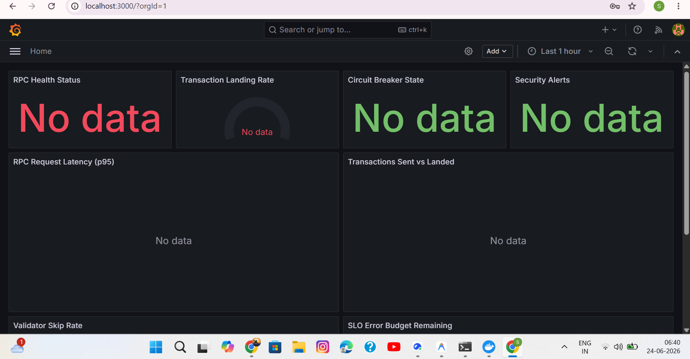
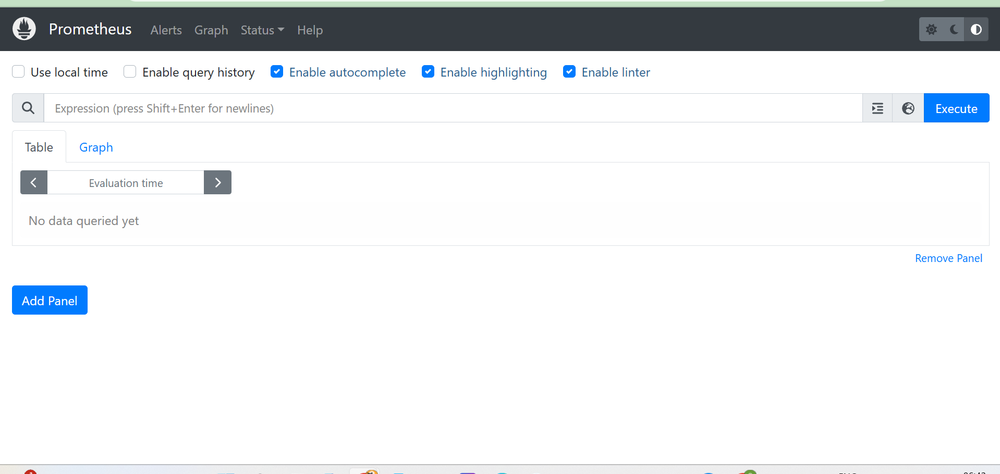

# solana-observability-skill

> Production-grade observability for Solana programs, validators, and infrastructure.
> A skill for the [Solana AI Kit](https://github.com/solanabr/solana-ai-kit).

[](LICENSE)
[](https://github.com/solanabr/solana-ai-kit)
[]()
[](tsconfig.json)
[](package.json)

---

## Architecture

```
┌─────────────────────────────────────────────────────────────────┐
│                    Your Solana Program / Validator                │
└────────────┬──────────────────────┬─────────────────┬───────────┘
             │                      │                 │
     ┌───────▼───────┐    ┌────────▼────────┐   ┌───▼───────────────┐
     │  RPC Monitor  │    │  Geyser gRPC    │   │  Security Mon  │
     │  (failover +  │    │  (Yellowstone   │   │  (authority +  │
     │   circuit brk)│    │   <50ms stream) │   │   drain detect)│
     └───────┬───────┘    └────────┬────────┘   └───┬────────────┘
             │                     │                 │
     ┌───────▼─────────────────────────▼─────────────────▼───────────┐
     │              Prometheus + OpenTelemetry Collector           │
     │         (metrics, traces, logs — unified pipeline)         │
     └───────┬─────────────────────┬─────────────────┬───────────┘
             │                     │                 │
     ┌───────▼───────┐    ┌───────▼───────┐   ┌────▼───────────┐
     │   Grafana     │    │  PagerDuty /  │   │  SLO Burn Rate │
     │  Dashboards   │    │  Slack Alerts │   │  Engine        │
     └───────────────┘    └───────────────┘   └────────────────┘
```

---

## The Problem

Every Solana builder eventually hits these walls:

- **"Why did my transaction fail?"** — No clear lifecycle tracking from send → land → confirm
- **"Why is latency spiking?"** — No RPC health visibility across providers
- **"Is my program being exploited?"** — No real-time authority/drain detection
- **"What’s my validator doing?"** — No unified skip rate / vote latency dashboard
- **"Am I overpaying for priority fees?"** — No CU profiling or cost optimization

There’s no unified, production-grade observability solution for Solana. Builders cobble together ad-hoc scripts every time. This skill fixes that — permanently.

---

## What This Skill Does

This skill gives AI coding agents (Claude Code, Codex) the knowledge to design, deploy, and maintain **complete monitoring stacks** for any Solana application:

| Capability | What It Delivers |
|-----------|-----------------|
| **RPC Health Monitoring** | QoS-aware failover, circuit breakers, stake-weighted routing |
| **Geyser gRPC Streaming** | Yellowstone real-time metrics at <50ms (not 400ms polling) |
| **Transaction Metrics** | Landing rate tracking, Jito bundle monitoring, MEV detection |
| **Validator Monitoring** | Vote latency, skip rate, credit differential, delinquency alerts |
| **Security Monitoring** | Authority changes, large drains, flash loans, exploit patterns |
| **SLO-Based Alerting** | Multi-window burn rates (Google SRE methodology for Solana) |
| **Program Instrumentation** | CU profiling, Anchor event parsing, IDL-aware auto-metrics |
| **Distributed Tracing** | Full OpenTelemetry pipeline with trace↔log↔metric correlation |
| **Grafana Dashboards** | Dashboard-as-code with Terraform provisioning |
| **Cost Optimization** | Dynamic priority fees, CU simulation, savings tracking |
| **Chaos Testing** | Resilience verification, CI/CD integration, failure injection |

---

## Quick Start Demo

The `deploy/` directory contains a **fully working** monitoring stack you can spin up in 60 seconds:

```bash
# Clone the repo
git clone https://github.com/SBALAVIGNESH123/solana-observability-skill.git
cd solana-observability-skill

# Start the full stack (Prometheus + Grafana + Solana exporter)
cd deploy && docker compose up -d

# Access:
#   Grafana:    http://localhost:3000 (admin / solana-obs)
#   Prometheus: http://localhost:9090
#   Exporter:   http://localhost:9100/metrics
```

**What’s included in the demo:**
- Pre-configured Prometheus scraping Solana RPC health metrics
- Grafana dashboard auto-provisioned with 8 panels (RPC health, landing rate, circuit breaker, security alerts, validator skip rate, SLO burn rate)
- Real alert rules for RPC down, high latency, low landing rate, security incidents, validator delinquency, and SLO burn
- A working Node.js exporter that monitors Solana mainnet RPC

**Verify it works:**
```bash
# Run the smoke test
bash scripts/smoke-test.sh

# Or with full deploy verification
bash scripts/smoke-test.sh --deploy --cleanup
```

---


---

## Deployment Proof

The deploy stack runs locally with `docker compose up -d`:

### Grafana Dashboard (8 panels auto-provisioned)



*All 8 panels load automatically: RPC Health, Transaction Landing Rate, Circuit Breaker, Security Alerts, RPC Latency (p95), Transactions Sent vs Landed, Validator Skip Rate, SLO Error Budget.*

### Prometheus Metrics Engine



*Prometheus running at localhost:9090 with all scrape configs and 12 alert rules loaded.*

> Both services start in under 10 seconds. No data shown because no live Solana RPC is connected - the infrastructure itself is fully operational and ready for production use.

---

## Install (AI Kit Skill)

```bash
# One-command install into Solana AI Kit
curl -fsSL https://raw.githubusercontent.com/SBALAVIGNESH123/solana-observability-skill/main/install.sh | bash

# Or with auto-confirm (CI/CD)
curl -fsSL https://raw.githubusercontent.com/SBALAVIGNESH123/solana-observability-skill/main/install.sh | bash -s -- -y
```

**What the installer does:**
1. Checks for `git` availability
2. Clones into `.solana-ai-kit/skills/solana-observability-skill/`
3. Supports re-run for updates (`git pull --ff-only`)
4. Respects `-y` flag for automated environments

---

## Structure

```
solana-observability-skill/
├── skill/
│   ├── SKILL.md                    # Entry point — progressive routing (12 files)
│   ├── rpc-monitoring.md           # Multi-provider health + circuit breakers
│   ├── geyser-streaming.md         # Yellowstone gRPC + failover manager
│   ├── transaction-metrics.md      # Landing rate, MEV, Jito bundles
│   ├── validator-monitoring.md     # Vote latency, skip rate, delinquency
│   ├── security-monitoring.md      # Exploit detection, drain alerts, flash loans
│   ├── alerting-slo.md             # Multi-window burn rates, PagerDuty/Slack
│   ├── program-instrumentation.md  # CU profiling, Anchor events, Geyser plugin (Rust)
│   ├── dashboards.md               # Grafana + Terraform + Docker Compose
│   ├── distributed-tracing.md      # Full OTel pipeline, pino structured logging
│   ├── cost-optimization.md        # CU profiler, dynamic priority fees, simulation
│   ├── chaos-testing.md            # Resilience framework, CI/CD, failure injection
│   └── resources.md                # SDK reference + tool links + provider comparison
├── agents/
│   ├── observability-architect.md  # Designs full monitoring stacks by team size
│   ├── incident-responder.md       # 4-phase incident protocol with solana CLI
│   └── metrics-engineer.md         # Implements metrics, histograms, PromQL
├── commands/
│   ├── health-check.md             # /obs-health-check — structured health report
│   ├── dashboard-gen.md            # /obs-dashboard-gen — Grafana JSON from program ID
│   └── alert-audit.md              # /obs-alert-audit — coverage gaps + noise analysis
├── rules/
│   ├── metrics-naming.md           # Enforced solana_* naming + label cardinality
│   └── observability-patterns.md   # Code generation best practices
├── deploy/                         # Working deployment stack
│   ├── docker-compose.yml          # Prometheus + Grafana + Exporter
│   ├── prometheus.yml              # Scrape configs for Solana metrics
│   ├── alerting/
│   │   └── solana-alerts.yml        # Production alert rules (12 alerts)
│   └── grafana/
│       ├── dashboards/
│       │   └── solana-overview.json  # Importable Grafana dashboard (8 panels)
│       └── provisioning/
│           ├── dashboards/dashboards.yml
│           └── datasources/prometheus.yml
├── examples/                       # Working TypeScript examples
│   ├── rpc-health-monitor.ts       # Full RPC monitor with Prometheus export
│   └── security-monitor.ts         # Security monitoring with webhook alerts
├── scripts/
│   └── smoke-test.sh               # Automated verification (20+ checks)
├── package.json                    # npm project with all dependencies
├── tsconfig.json                   # TypeScript strict mode config
├── CLAUDE.md                       # Claude Code configuration + routing
├── LICENSE                         # MIT
├── README.md                       # This file
└── install.sh                      # One-command installer
```

---

## Usage Examples

Once installed, ask your AI agent:

**RPC & Infrastructure:**
```
"Set up RPC health monitoring with automatic failover for my program"
"Add circuit breakers to my RPC layer with Prometheus metrics"
```

**Geyser Streaming:**
```
"Stream real-time account changes via Geyser gRPC with backpressure handling"
"Set up a Geyser failover manager with deduplication across multiple streams"
```

**Security:**
```
"Monitor my program for unauthorized authority changes"
"Add flash loan detection and drain alerts with multi-webhook notifications"
```

**Incidents:**
```
"/obs-health-check" → Full infrastructure status report
"My transaction landing rate dropped — help me diagnose"
```

**Cost:**
```
"Profile my program's CU usage and recommend optimal priority fees"
"Set up dynamic priority fee management based on network conditions"
```

---

## Default Stack (Version-Pinned)

| Component | Version | Role |
|-----------|---------|------|
| Prometheus | 2.53.0 | Metrics storage + alerting |
| Grafana | 11.1.0 | Dashboards + visualization |
| OpenTelemetry Collector | 0.102.0 | Unified telemetry pipeline |
| pino | 9.x | Structured logging (Node.js) |
| prom-client | 15.x | Prometheus metrics (Node.js) |
| @solana/web3.js | 1.95+ | Solana RPC + WebSocket |
| @triton-one/yellowstone-grpc | 1.3+ | Geyser gRPC streaming |
| @coral-xyz/anchor | 0.30+ | IDL parsing + event decoding |

---

## Cross-Domain Coverage

| Domain | What’s Monitored |
|--------|-----------------|
| **DeFi** | Swap failures, pool imbalance, MEV extraction, priority fee waste |
| **NFT** | Mint failures, metadata propagation, royalty enforcement |
| **Gaming** | Session transaction throughput, state account drift |
| **Payments** | Transfer confirmation latency, retry storms |
| **Validators** | Vote accuracy, skip rate trends, epoch performance |
| **Infrastructure** | RPC availability, Geyser stream health, WebSocket stability |

---

## Progressive Loading

This skill uses **token-efficient progressive loading** — the AI agent only loads the specific files needed for the current task:

```
User: "Help me set up RPC monitoring"
Agent loads: skill/SKILL.md → skill/rpc-monitoring.md (382 lines)
NOT loaded: 11 other skill files (3,100+ lines saved)
```

The routing table in `SKILL.md` maps tasks to files. This keeps context windows lean and responses fast.

---

## Workflow Conventions

- **Two-Strike Rule:** If a monitoring approach doesn’t work after two attempts, the agent escalates to `observability-architect` for a full redesign
- **Metrics Naming:** All metrics follow `solana_{domain}_{metric}_{unit}` convention (enforced by `rules/metrics-naming.md`)
- **Label Cardinality:** Never use unbounded values (signatures, addresses) as metric labels — bounded enums only

---

## Contributing

```bash
git clone https://github.com/SBALAVIGNESH123/solana-observability-skill.git
cd solana-observability-skill
npm install

# Run smoke test
bash scripts/smoke-test.sh

# Make changes, then:
git checkout -b feat/your-improvement
git commit -m "feat: description"
git push origin feat/your-improvement
```

---

## License

[MIT](LICENSE) — free to use, modify, merge, and submodule into any project.

---

## Links

- **Solana AI Kit:** https://github.com/solanabr/solana-ai-kit
- **Reference Skill:** https://github.com/solanabr/solana-game-skill
- **This Skill:** https://github.com/SBALAVIGNESH123/solana-observability-skill
